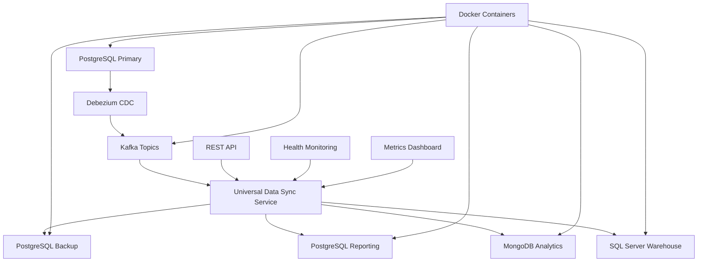

# Debezium Universal Data Sync

A .NET 9 minimal API application that demonstrates real-time cross-database synchronization using Debezium CDC (Change Data Capture) and Apache Kafka.

## 🚀 Overview

This application showcases a universal data synchronization architecture that can capture changes from PostgreSQL and synchronize them across multiple target databases in real-time:

- **Source Database**: PostgreSQL with Debezium CDC
- **Message Broker**: Apache Kafka for change event streaming
- **Target Databases**: PostgreSQL, MongoDB, SQL Server
- **Sync Engine**: Universal Data Sync Service with configurable pipelines

## 📋 Features

### ✅ Universal Data Synchronization
- **Multi-source support**: Kafka, PostgreSQL CDC, SQL Server CDC, MongoDB Change Streams
- **Multi-target support**: PostgreSQL, MongoDB, SQL Server
- **Real-time processing**: Sub-second latency for change propagation
- **Configurable pipelines**: Define custom sync rules with filtering and transformation

### ✅ Cross-Database Compatibility
- **PostgreSQL → PostgreSQL**: Backup and reporting database synchronization
- **PostgreSQL → MongoDB**: Analytics and data lake synchronization
- **PostgreSQL → SQL Server**: Enterprise data warehouse integration
- **Mixed pipelines**: Multiple targets from single source

### ✅ Enterprise Features
- **Health monitoring**: Real-time health checks for all data sources and targets
- **Metrics and statistics**: Detailed sync performance metrics
- **Retry policies**: Configurable exponential and linear retry strategies
- **REST API**: Management endpoints for monitoring and control
- **Docker support**: Complete containerized infrastructure

## 🏗️ Architecture



### Core Components

1. **Data Sources**: Pluggable connectors for different database types
2. **Data Targets**: Universal writers for various target databases
3. **Sync Pipelines**: Configurable data flow with filtering and transformation
4. **Universal Sync Service**: Central orchestration and monitoring
5. **Health Monitoring**: Real-time health checks and metrics

## 🚀 Quick Start

### Prerequisites
- .NET 9 SDK
- Docker Desktop
- Git

### 1. Clone and Build
```bash
git clone <repository-url>
cd DebeziumDemoApp
dotnet restore
dotnet build
```

### 2. Start Infrastructure
```bash
docker-compose up -d
```

This starts:
- PostgreSQL Primary (port 5432)
- PostgreSQL Backup (port 5433)
- PostgreSQL Reporting (port 5434)
- MongoDB (port 27017)
- SQL Server (port 1433)
- Kafka (port 9092)
- Zookeeper (port 2181)
- Debezium Connect (port 8083)

### 3. Configure Debezium Connector
```bash
curl -i -X POST -H "Accept:application/json" -H "Content-Type:application/json" \
localhost:8083/connectors/ -d @debezium-connector-config.json
```

### 4. Run Application
```bash
dotnet run
```

The application will start on `http://localhost:5269` and automatically:
- Initialize all sync pipelines
- Connect to data sources and targets
- Begin processing CDC events

## 📊 Configuration

### Sync Pipelines
Configure data synchronization pipelines in `appsettings.json`:

```json
{
  "SyncPipelines": {
    "ProductsToBackup": {
      "Source": "PrimaryKafka",
      "Target": "BackupPostgres",
      "Enabled": true,
      "BatchSize": 50,
      "FilterExpression": "table:products",
      "RetryPolicy": "Exponential",
      "MaxRetries": 3
    }
  }
}
```

### Data Sources
```json
{
  "DataSources": {
    "PrimaryKafka": {
      "Type": "Kafka",
      "BootstrapServers": "localhost:9092",
      "Topics": ["debezium.public.products"]
    }
  }
}
```

### Data Targets
```json
{
  "DataTargets": {
    "BackupPostgres": {
      "Type": "PostgreSQL",
      "ConnectionString": "Host=localhost;Port=5433;..."
    }
  }
}
```

## 🔧 API Endpoints

### Health & Monitoring
- `GET /api/universal-sync/status` - Overall system status
- `GET /api/universal-sync/metrics` - Detailed performance metrics
- `POST /api/universal-sync/health-check` - Trigger health checks
- `GET /api/universal-sync/logs` - Recent sync logs

### Pipeline Management
- `POST /api/universal-sync/pipelines/{name}/enable` - Enable pipeline
- `POST /api/universal-sync/pipelines/{name}/disable` - Disable pipeline

## 📈 Monitoring

The application provides comprehensive monitoring through:

1. **Health Dashboard**: Real-time status of all components
2. **Performance Metrics**: Throughput, latency, error rates
3. **Sync Statistics**: Records processed, success rates, retry counts
4. **REST API**: Programmatic access to all monitoring data

## 🧪 Testing

### Manual Testing
1. Add data to PostgreSQL primary database
2. Observe real-time synchronization to target databases
3. Check API endpoints for sync status and metrics

## 🐳 Docker Services

| Service | Port | Description |
|---------|------|-------------|
| postgres-primary | 5432 | Primary PostgreSQL database |
| postgres-backup | 5433 | Backup PostgreSQL database |
| postgres-reporting | 5434 | Reporting PostgreSQL database |
| mongodb | 27017 | MongoDB analytics database |
| sqlserver | 1433 | SQL Server warehouse |
| kafka | 9092 | Apache Kafka message broker |
| zookeeper | 2181 | Kafka coordination service |
| debezium-connect | 8083 | Debezium connector service |

## 🔒 Security Considerations

- Database credentials should be stored in secure configuration
- Enable SSL/TLS for production database connections
- Configure Kafka authentication for production use
- Use Docker secrets or environment variables for sensitive data

## 📚 Key Concepts

### Change Data Capture (CDC)
Debezium captures row-level changes in the source database transaction log and streams them as events to Kafka.

### Universal Data Sync
The service abstracts data source and target differences, providing a consistent interface for cross-database synchronization.

### Sync Pipelines
Configurable data flows that connect sources to targets with filtering, transformation, and retry logic.

## 🤝 Contributing

1. Fork the repository
2. Create a feature branch
3. Make your changes
4. Add tests for new functionality
5. Submit a pull request

## 📄 License

This project is licensed under the MIT License - see the LICENSE file for details.

## 🆘 Support

For issues and questions:
1. Check the API documentation at `/swagger` (if enabled)
2. Review the health status at `/api/universal-sync/status`
3. Check application logs for detailed error information