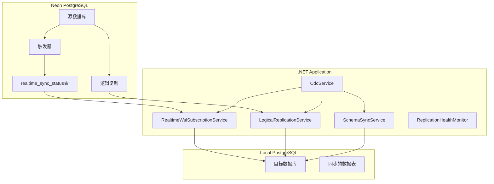

# PostgreSQL WAL Changes Streaming with .NET and Npgsql

## 项目概述

这是一个基于 .NET 的 PostgreSQL WAL (Write-Ahead Log) 变化流处理应用程序，使用 Npgsql 实现实时数据库变更同步。该系统支持从 Neon PostgreSQL 数据库到本地数据库的实时数据同步，具有错误恢复、性能监控和 Schema 同步功能。

## 🚀 核心功能

### 1. 实时WAL同步
- **RealtimeWalSubscriptionService**: 基于触发器的实时同步
- **LogicalReplicationService**: PostgreSQL逻辑复制同步
- **WAL流处理**: 支持INSERT、UPDATE、DELETE操作

### 2. Schema同步
- **SchemaSyncService**: 自动同步数据库架构变更
- **表结构同步**: 创建表、索引和约束
- **健康监控**: 连接状态监控和自动恢复

### 3. CDC (Change Data Capture)
- **CdcService**: 变更数据捕获服务
- **事件处理**: 支持多种变更事件类型
- **死信队列**: 处理失败的事件

### 4. 监控和管理
- **复制健康监控**: 实时监控复制状态
- **性能指标**: 同步延迟、吞吐量监控
- **管理API**: 手动触发同步、状态查询

## 🏗️ 系统架构



## 📁 项目结构

```
Stream Postgres WAL Changes Into .NET with Npgsql App/
├── Configuration/
│   └── SchemaSyncOptions.cs          # Schema同步配置
├── Data/
│   ├── AppDbContext.cs               # Neon数据库上下文
│   ├── LocalDbContext.cs             # 本地数据库上下文
│   └── LocalOutboxEvent.cs           # 本地事件模型
├── Extensions/
│   ├── OrderEndpoints.cs             # 订单API端点
│   ├── PublicEndpoints.cs            # 公共API端点
│   ├── RealtimeWalSubscriptionEndpoints.cs  # WAL同步API
│   ├── ReplicationEndpoints.cs       # 复制管理API
│   ├── SchemaSyncEndpoints.cs        # Schema同步API
│   └── WalStreamingEndpoints.cs      # WAL流API
├── Models/
│   ├── ChangeEvents.cs               # 变更事件模型
│   ├── Order.cs                      # 订单模型
│   └── OutboxEvent.cs                # 事件模型
├── Services/
│   ├── CdcService.cs                 # CDC服务
│   ├── LogicalReplicationService.cs  # 逻辑复制服务
│   ├── RealtimeWalSubscriptionService.cs  # 实时WAL订阅服务
│   ├── SchemaSyncService.cs          # Schema同步服务
│   └── [其他服务文件...]
├── Tests/
│   ├── DirectWalTest.cs              # WAL测试
│   └── OrderSyncTest.cs              # 同步测试
├── appsettings.json                  # 配置文件
├── Program.cs                        # 程序入口
└── README.md                         # 项目文档
```

## ⚙️ 配置说明

### appsettings.json 配置项

```json
{
  "ConnectionStrings": {
    "DefaultConnection": "Neon数据库连接字符串",
    "LocalConnection": "本地数据库连接字符串"
  },

  "Replication": {
    "SlotName": "order_events_slot",
    "PublicationName": "cdc_publication",
    "HeartbeatInterval": 30,
    "RetryInterval": 5000,
    "MaxRetryAttempts": 10,
    "EnableWalDecoding": true,
    "ReplicatedTables": ["Orders", "OutboxEvents"]
  },

  "SchemaSync": {
    "NormalInterval": "00:05:00",
    "ShortInterval": "00:01:00",
    "LongInterval": "00:15:00",
    "HealthCheckThreshold": "00:10:00",
    "MaxConsecutiveErrors": 5
  },

  "Cdc": {
    "Enabled": true,
    "StartupDelay": 10,
    "EventProcessingTimeout": 30000,
    "MaxConcurrentEventProcessors": 10,
    "EnableDeadLetterQueue": true
  },

  "LocalReplication": {
    "Enabled": true,
    "SubscriptionName": "neon_to_local_subscription",
    "SlotName": "neon_to_local_slot",
    "MonitoringInterval": 30,
    "LogReplicationEvents": true
  },

  "Features": {
    "EnableSchemaSync": true
  }
}
```

## 🚀 快速开始

### 1. 环境准备

```bash
# 确保已安装 .NET 9.0 SDK
dotnet --version

# 安装 PostgreSQL (本地用于目标数据库)
# 配置 Neon PostgreSQL 数据库
```

### 2. 数据库设置

```sql
-- 在 Neon 数据库中创建发布
CREATE PUBLICATION cdc_publication FOR TABLE Orders, OutboxEvents;

-- 创建触发器用于实时同步
CREATE OR REPLACE FUNCTION trigger_realtime_sync()
RETURNS TRIGGER AS $$
BEGIN
    INSERT INTO realtime_sync_status (last_order_id, sync_type, operation_time)
    VALUES (NEW.id, TG_OP, NOW());
    RETURN NEW;
END;
$$ LANGUAGE plpgsql;

-- 创建语句级触发器（推荐用于批量操作）
CREATE OR REPLACE TRIGGER trigger_realtime_sync_statement
AFTER INSERT OR UPDATE OR DELETE ON Orders
FOR EACH STATEMENT EXECUTE FUNCTION trigger_realtime_sync();
```

### 3. 配置连接字符串

在 `appsettings.json` 中配置数据库连接：

```json
{
  "ConnectionStrings": {
    "DefaultConnection": "Host=your-neon-host;Port=5432;Database=yourdb;Username=youruser;Password=yourpassword;SSL Mode=Require;",
    "LocalConnection": "Host=localhost;Port=5432;Database=localdb;Username=postgres;Password=yourpassword;SSL Mode=Prefer;"
  }
}
```

### 4. 运行应用程序

```bash
# 恢复依赖包
dotnet restore

# 编译项目
dotnet build

# 运行应用程序
dotnet run
```

## 📊 API 端点

### 公共端点（无需认证）

- `GET /` - 健康检查
- `GET /health/ready` - 就绪状态检查
- `GET /health/live` - 存活状态检查

### 认证端点

- `POST /auth/login` - 用户登录
- `POST /auth/refresh` - 刷新令牌

### WAL同步端点

- `GET /api/wal/subscription/status` - 获取同步状态
- `POST /api/wal/subscription/start` - 启动同步
- `POST /api/wal/subscription/stop` - 停止同步
- `POST /api/wal/subscription/force-sync/{orderId}` - 强制同步特定订单

### Schema同步端点

- `GET /api/schema/sync/status` - Schema同步状态
- `POST /api/schema/sync/trigger` - 手动触发Schema同步
- `GET /api/schema/tables` - 获取表结构信息

### 复制管理端点

- `GET /api/replication/slots` - 获取复制槽状态
- `POST /api/replication/reset-slot/{slotName}` - 重置复制槽
- `GET /api/replication/diagnosis` - 复制诊断信息

## 🔧 故障排除

### 常见问题

#### 1. 重复键错误 (23505)

**问题**: `duplicate key value violates unique constraint "orders_pkey"`

**解决方案**:
- 检查 `realtime_sync_status` 表是否有重复记录
- 清理失败的同状态记录：`DELETE FROM realtime_sync_status WHERE last_order_id IN (...)`
- 重启应用程序重新开始同步

#### 2. 连接取消错误

**问题**: `The operation was canceled`

**解决方案**:
- 检查数据库连接配置
- 确认网络连接稳定
- 调整连接超时设置

#### 3. Schema同步失败

**问题**: 表创建或结构同步失败

**解决方案**:
- 检查本地数据库权限
- 确认目标表不存在冲突
- 手动清理失败的表结构

### 监控和日志

#### 日志级别配置

```json
{
  "Logging": {
    "LogLevel": {
      "Stream_Postgres_WAL_Changes_Into_.NET_with_Npgsql_App.Services.RealtimeWalSubscriptionService": "Information",
      "Stream_Postgres_WAL_Changes_Into_.NET_with_Npgsql_App.Services.SchemaSyncService": "Information"
    }
  }
}
```

#### 关键监控指标

- **同步延迟**: 实时监控数据同步延迟
- **错误率**: 同步操作的成功/失败率
- **吞吐量**: 每秒处理的记录数
- **连接状态**: 数据库连接健康状态

## 🧪 测试

### 单元测试

```bash
# 运行所有测试
dotnet test

# 运行特定测试类
dotnet test --filter "FullyQualifiedName~OrderSyncTest"
dotnet test --filter "FullyQualifiedName~DirectWalTest"
```

### 手动测试场景

#### 1. 批量插入测试

```sql
-- 在Neon数据库中插入1000条记录
INSERT INTO Orders (Id, CustomerName, Amount, Status, CreatedAt, UpdatedAt)
SELECT
    gen_random_uuid(),
    'Customer ' || generate_series,
    random() * 1000,
    'pending',
    NOW(),
    NOW()
FROM generate_series(1, 1000);
```

#### 2. 更新测试

```sql
-- 批量更新记录
UPDATE Orders SET CustomerName = '张三', Status = 'processed' WHERE Status = 'pending';
```

#### 3. 删除测试

```sql
-- 删除部分记录
DELETE FROM Orders WHERE Status = 'processed' LIMIT 100;
```

## 🔒 安全配置

### JWT配置

```json
{
  "Jwt": {
    "Secret": "your-secret-key-here",
    "Issuer": "your-app",
    "Audience": "your-users"
  }
}
```

### 数据库安全

- 使用SSL连接
- 配置适当的数据库权限
- 定期轮换密码
- 监控异常访问

## 📈 性能优化

### 1. 批处理优化

- 调整批处理大小：`"BatchSize": 1000`
- 优化同步间隔：根据业务需求调整
- 使用连接池：配置合适的连接池大小

### 2. 内存优化

- 配置内存缓存限制：`"SizeLimit": 104857600` (100MB)
- 优化对象生命周期管理
- 及时释放资源

### 3. 数据库优化

- 创建适当的索引
- 定期清理同步状态表
- 优化查询性能

## 🔄 部署指南

### Docker部署

```dockerfile
FROM mcr.microsoft.com/dotnet/aspnet:9.0
WORKDIR /app
COPY . .
EXPOSE 80
ENTRYPOINT ["dotnet", "Stream Postgres WAL Changes Into .NET with Npgsql App.dll"]
```

### 环境变量

```bash
# 数据库连接
DefaultConnection=Server=neon-host;Database=db;User=user;Password=pass;
LocalConnection=Server=localhost;Database=localdb;User=postgres;Password=pass;

# 功能开关
EnableSchemaSync=true
CdcEnabled=true

# 日志级别
Logging__LogLevel__Default=Information
```

## 🤝 贡献指南

1. Fork 项目
2. 创建功能分支
3. 提交更改
4. 推送到分支
5. 创建 Pull Request

## 📄 许可证

MIT License - 详见 LICENSE 文件

## �� 支持

如有问题或建议，请：
1. 查看本文档的故障排除部分
2. 检查应用程序日志
3. 创建 Issue 描述问题
4. 联系开发团队

---

**注意**: 本系统设计用于生产环境，建议在部署前进行充分的测试和监控配置。